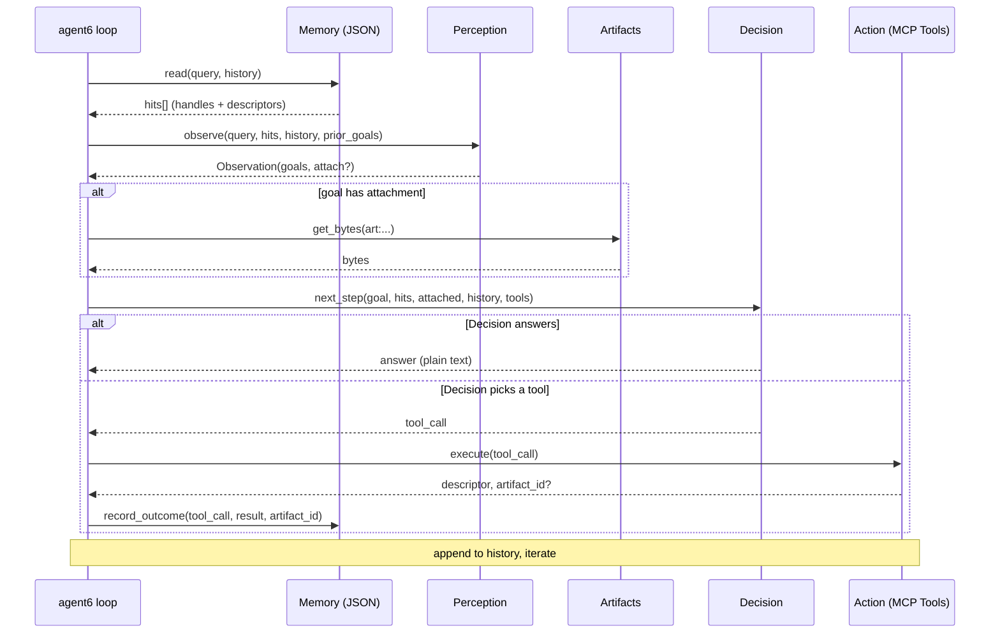

# Architecture Design

## Overview

The `agent6.py` architecture is designed around a central iterative loop that coordinates four primary roles: **Memory**, **Perception**, **Decision**, and **Action**. In addition, an **Artifacts** module is used to handle data attachments. This decoupled architecture allows for distinct separation of concerns.

To ensure high data quality and efficient LLM interactions, **Pydantic** is used across boundaries to validate inputs and outputs. Furthermore, **all LLM inference calls** are strictly routed through our custom **LLM Gateway**.

## Core Components

- **agent6 loop (Controller)**: The main orchestrator that runs the iteration loop. It coordinates data flow between all the other components and manages the history append process.
- **Memory**: Responsible for context retrieval and storage, backed by a **JSON file**. It processes queries and history to return relevant `hits` (handles and descriptors) and records outcomes from tool executions.
- **Perception**: Observes the current state (query, hits, history, prior goals) to deduce the current `Observation` (goals and whether an attachment is needed). Uses **Pydantic** to enforce structured LLM responses. All underlying LLM calls are routed through the **LLM Gateway**.
- **Artifacts**: A storage or retrieval mechanism for raw data/bytes when a goal requires an attachment.
- **Decision**: The core LLM or reasoning engine that takes the current context and decides the next step. It uses **Pydantic** to guarantee output conforms to either a direct text answer or a precise tool invocation request. All underlying LLM calls are routed through the **LLM Gateway**.
- **Action (MCP)**: The execution layer that interacts with the Model Context Protocol (MCP) to execute tool calls. Exposes **User-Defined MCP Tools** such as:
  - `read_file`: Read contents from the local file system.
  - `write_file`: Write contents to a file.
  - `web_search`: Perform searches to fetch real-time information.
  - `run_script`: Execute arbitrary scripts in a secure sandbox.

## Interaction Flow (One Iteration)

The main loop executes the following sequence of operations per iteration:

